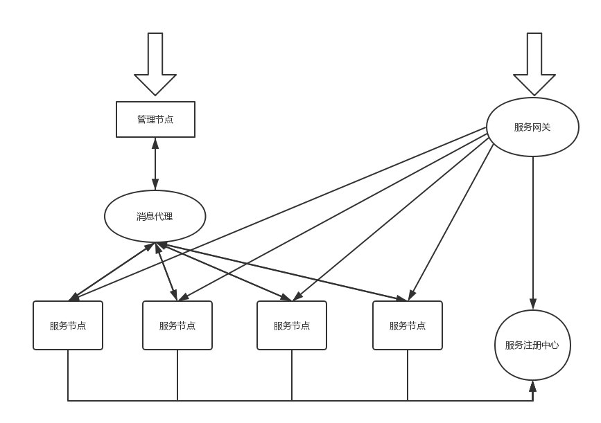
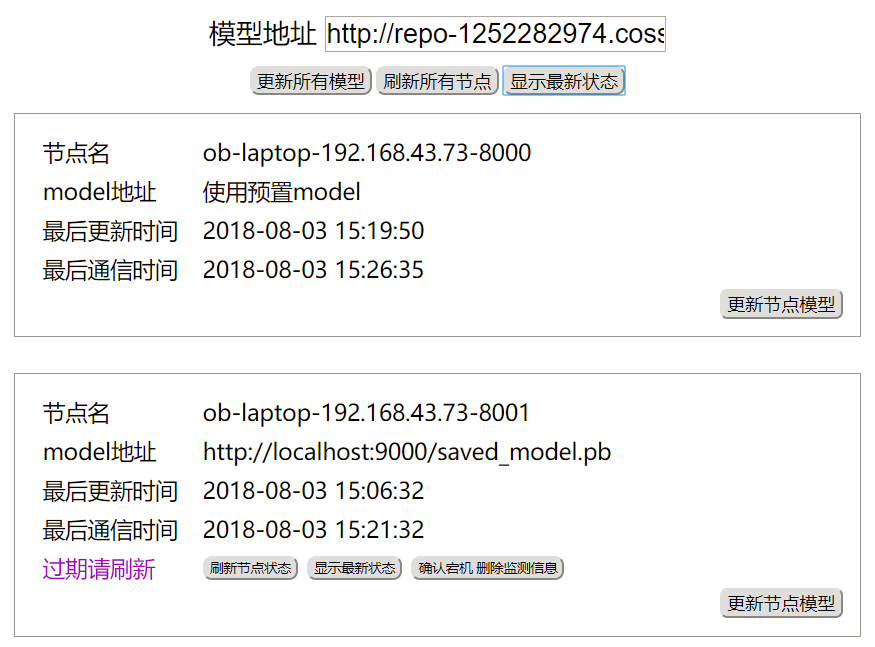

# 实习项目 tensorflow服务平台

tensorflow是业界较为成熟的人工智能框架。为方便编程人员，tensorlfow提供了java的api
。而restful api这种轻量级的通信方式是企业系统中较为常用的。本项目的目标是将tensorflow做成基于java的restful
 api的服务平台。可以通过restful api的形式调用tensorflow的分类预测回归等接口，并提供了一个管理页面，让管理员了解各个服务节点的状态和动态更新各个节点所使用的模型。

本系统以tensorflow仓库中物体探测的模型为例，编写java的调用代码，并进行服务化。参考了github tensorflow/model项目下的java object_detect代码，进行修改生成的restful api风格的tensorflow服务

[参考的原代码及说明地址](https://github.com/tensorflow/models/tree/de2842408a1790a56718c293e01e0d555fa84035/samples/languages/java/object_detection)链接所指代码的版本就是使用的版本
## 依赖

- jdk8
- rabbitmq
- tensorflow r1.8

## 模块说明

|模块|职责|
|-----|-----|
|eureka4tensorflow|服务注册中心|
|gateway_zuul|网关|
|objectdetect|tensorflow服务节点|
|obdetect_ctrl|tensorflow控制节点|

## 安装tensorflow r1.8

`tensorflow pip3 install --upgrade --ignore-installed  --upgrade -i https://pypi.tuna.tsinghua.edu.cn/simple tensorflow==1.8.0`

## 架构图



整个架构比较简单。从服务的角度看，就是网关+服务注册中心+服务节点。从控制的角度看，控制节点通过rabbitMq与服务节点通信，传递状态信息和控制信息。

## 启动

因为模块间依赖，服务的三个模块：网关 服务注册中心 服务节点中，必须先启动服务注册中心（这样其他的才能向其注册嘛）

在启动服务节点和控制节点前，必须先正确安装rabbitMq并运行，这里的配置需要在rabbitMq创建一个`/objectdetect`的虚拟主机。

## 功能示意

### 服务节点

```
请求：
POST https://localhost/service
Accept: */*
Cache-Control: no-cache
content-type: application/json

[
    "http://jianbujingimages.moontell.cn/FrrkTtsITfXki44oJqk6i3IUzv2x",
    "http://jianbujingimages.moontell.cn/FhD-asgS-HOuUssL1dVzmgkhD2v-"
]

响应：
HTTP/1.1 200 
Content-Type: application/json;charset=UTF-8
Transfer-Encoding: chunked
Date: Tue, 17 Jul 2018 08:33:58 GMT
Connection: close
Proxy-Connection: keep-alive

[
  {
    "imageURL": "http://jianbujingimages.moontell.cn/FrrkTtsITfXki44oJqk6i3IUzv2x",
    "detectCells": [
      "Found person (score: 0.9353)",
      "Found laptop (score: 0.8388)",
      "Found keyboard (score: 0.6445)"
    ]
  },
  {
    "imageURL": "http://jianbujingimages.moontell.cn/FhD-asgS-HOuUssL1dVzmgkhD2v-",
    "detectCells": [
      "Found cup (score: 0.9900)",
      "Found cell phone (score: 0.9838)",
      "Found mouse (score: 0.9833)"
    ]
  }
]

Response code: 200; Time: 1834ms; Content length: 381 bytes
```

请求体是网络图片的url数组。响应中给出了每个图片对应的检测结果。

`"Found mouse (score: 0.9833)"`表示 探测到了鼠标。

目前，网络图片的url数组不支持https。因为代码中使用了imageIO，这个不支持https的url。

### 控制节点



可以查看节点的状态和使用的模型地址，并更新模型地址。模型地址支持https。

下载模型时自动使用了断点续传和分片下载功能，用于确保大模型的传输。
