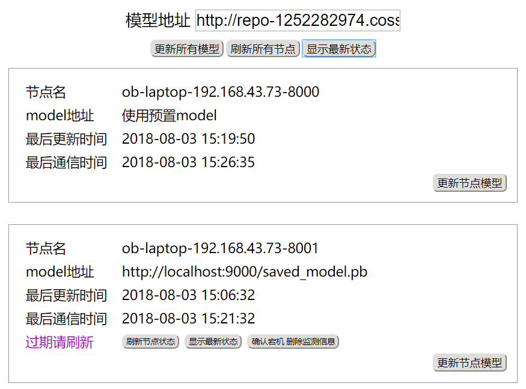
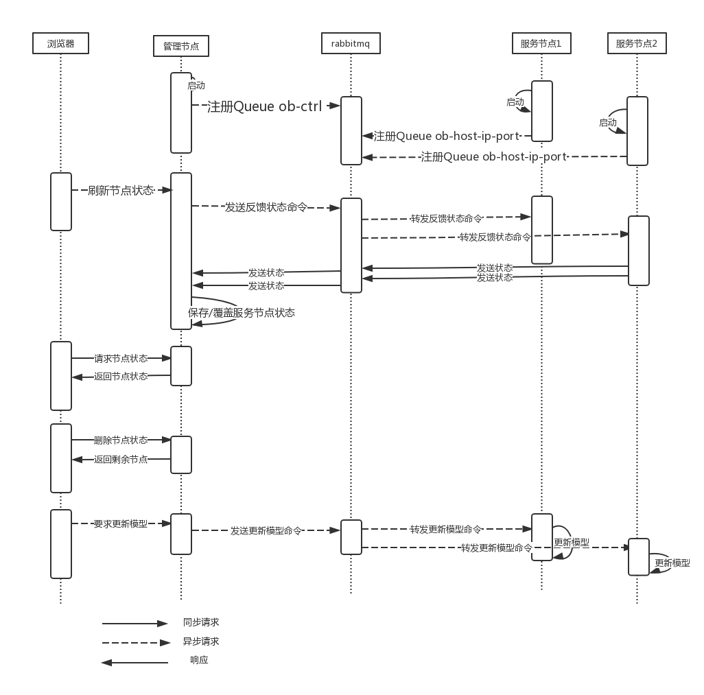
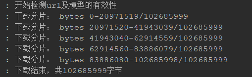
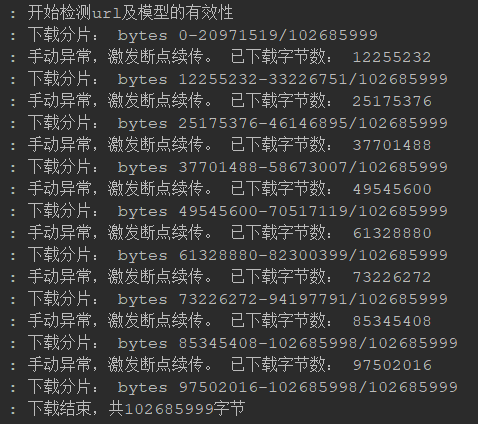

# 实习项目 tensorflow服务平台

tensorflow是业界较为成熟的人工智能框架。为方便编程人员，tensorlfow提供了java的api
。而restful api这种轻量级的通信方式是企业系统中较为常用的。本项目的目标是将tensorflow做成基于java的restful
 api的服务平台。可以通过restful api的形式调用tensorflow的分类预测回归等接口，并提供了一个管理页面，让管理员了解各个服务节点的状态和动态更新各个节点所使用的模型。

本系统以tensorflow仓库中物体探测的模型为例，编写java的调用代码，并进行服务化。参考了github tensorflow/model项目下的java object_detect代码，进行修改生成的restful api风格的tensorflow服务

[参考的原代码及说明地址](https://github.com/tensorflow/models/tree/de2842408a1790a56718c293e01e0d555fa84035/samples/languages/java/object_detection)链接所指代码的版本就是使用的版本

## 依赖

- jdk8
- rabbitmq
- tensorflow r1.8

## 模块说明

|模块|职责|
|-----|-----|
|eureka4tensorflow|服务注册中心|
|gateway_zuul|网关|
|objectdetect|tensorflow服务节点|
|obdetect_ctrl|tensorflow控制节点|

## 安装tensorflow r1.8

`tensorflow pip3 install --upgrade --ignore-installed  --upgrade -i https://pypi.tuna.tsinghua.edu.cn/simple tensorflow==1.8.0`

## 架构图


整个架构比较简单。从服务的角度看，就是网关+服务注册中心+服务节点。从控制的角度看，控制节点通过rabbitMq与服务节点通信，传递状态信息和控制信息。

## 启动

因为模块间依赖，服务的三个模块：网关 服务注册中心 服务节点中，必须先启动服务注册中心（这样其他的才能向其注册嘛）

在启动服务节点和控制节点前，必须先正确安装rabbitMq并运行，这里的配置需要在rabbitMq创建一个`/objectdetect`的虚拟主机。

## 功能示意

### 服务节点

```
请求：
POST https://localhost/service
Accept: */*
Cache-Control: no-cache
content-type: application/json

[
    "http://jianbujingimages.moontell.cn/FrrkTtsITfXki44oJqk6i3IUzv2x",
    "http://jianbujingimages.moontell.cn/FhD-asgS-HOuUssL1dVzmgkhD2v-"
]

响应：
HTTP/1.1 200 
Content-Type: application/json;charset=UTF-8
Transfer-Encoding: chunked
Date: Tue, 17 Jul 2018 08:33:58 GMT
Connection: close
Proxy-Connection: keep-alive

[
  {
    "imageURL": "http://jianbujingimages.moontell.cn/FrrkTtsITfXki44oJqk6i3IUzv2x",
    "detectCells": [
      "Found person (score: 0.9353)",
      "Found laptop (score: 0.8388)",
      "Found keyboard (score: 0.6445)"
    ]
  },
  {
    "imageURL": "http://jianbujingimages.moontell.cn/FhD-asgS-HOuUssL1dVzmgkhD2v-",
    "detectCells": [
      "Found cup (score: 0.9900)",
      "Found cell phone (score: 0.9838)",
      "Found mouse (score: 0.9833)"
    ]
  }
]

Response code: 200; Time: 1834ms; Content length: 381 bytes
```

请求体是网络图片的url数组。响应中给出了每个图片对应的检测结果。

`"Found mouse (score: 0.9833)"`表示 探测到了鼠标。

目前，网络图片的url数组不支持https。因为代码中使用了imageIO，这个不支持https的url。

### 控制节点



关于服务治理，由很多现成的实现，但却难以满足当前项目的需求。此项目较为特殊的地方在于，所使用的tensorflow模型是一个很重要的状态信息，并且更新模型设计到新模型加载和旧模型close的问题，不能简单的通过配置中心的方式解决，这是产生该平台的原因。此平台的职责是tensorflow服务实例进行管理。通过这个“集中式”的管理平台，运维人员可以便捷地了解各个服务实例的状态。另外，另外用户可以通过此平台进行tensorlfow模型的发布，并动态更新已存在服务实例所使用的模型。

#### 监测功能说明

当服务节点启动/崩溃重启时，会向管理平台（重新）注册自己，从而将自己纳入后台的管理，并发送自己的状态信息，包括：节点的ip/hostname/port、当前所使用的模型、模型更新时间、上次通信时间

通过此平台，管理员可以查看各个节点的上述属性。

平台会监测上次通信时间，如果上次通信时间大于5分钟，则提示用户该节点状态过期，提醒用户刷新单个节点的状态。若用户多次刷新该节点状态，该节点仍处于状态过期状态（为产生新的通信），则基本可以判定该节点宕机

用户可以删除状态过期节点中确认宕机的实例。注意这里的删除仅表示不显示这个节点信息，并未shutdown这个服务实例。</p>也就是，当服务启动时会自动向管理后台注册，当服务崩溃时，并不会自动注销，需要管理员根据上次通信时间及其他运维手段判断服务状态。

#### 更新模型功能说明
首先，该管理后台并不执行对各个节点模型的更新操作，而是发送更新模型的命令给各个节点，由各个节点执行自己的模型更新操作。</p>

管理后台收到浏览的更新模型请求后，会首先测试用户填写的模型ur是否正确。这里的正确有两个含义，第一个：url对应文件是否能下载，第二个：下载的文件是不是正确的模型文件。

管理后台测试成功后，会通过rabbitMq向所有/特定服务节点发送更新模型命令。

服务节点收到更新模型命令后，会从url下载模型文件到特定文件夹再从文件夹读取模型文件到内存（tensorflow 只支持从硬盘读，没办法）。加载完毕之后，之后的http请求处理线程就会使用新的模型。这里有一个问题，之前的线程还在使用旧的模型，新模型加载完毕的下一步就应该时close（这个close需要显式调用），但是又要等待所有旧线程使用完毕。

在这里使用读写锁。请求处理线程使用model时获取读锁，close旧模型需要获取写锁。只要还有线程在使用旧模型（占有读锁），close线程就没法获取写锁，无法close旧模型。
            
#### 实现原理/架构

关键词： broker模式 异步通信 发布订阅

首先用系统顺序图展示以下各个节点之间的交互
            


解释：启动部分，rabbitMq的消费者需要注册exchange、queue以及binding。这样消费者只要知道发送给哪个exchange以及路由键即可。

关于架构：可以看到，在系统中使用了大量的异步请求。这样的弊端是：发送请求和接收响应需要分成两步。这一点确实不怎么方便

这样设计的原因和本质是，rabbitMQ承担了代理的角色，可以算架构模式中的broker（代理）模式吧。下面将rabbitMQ称为代理。没有这个代理时，管理节点和服务节点要直接通信，首先管理节点和服务节点要互相知道。怎么互相知道？首先服务节点需要知道管理节点的ip端口，然后所有服务节点都需要向管理节点注册自己。这一套大概被服务注册/发现广泛使用了。

这样设计算挺好的吧，硬要说不好，大概就是管理节点和服务节点之间的强耦合。引入broker，那么管理节点和服务节点不进行直接的通信，只向broker发送消息。双方无需知道对方在哪里，怎么向彼此发送消息。只需要制定“契约”——通信内容的格式及其含义。类似面向对象设计中依赖倒置、面向接口而非实现，双方都遵守同一份契约（接口）。这也是我采用这个模式的原因。

其实这个broker的实现可以不是rabbitMQ，rabbitMQ带来了需要异步的问题，异步在这里优势和劣势都有。考虑到时间不足的原因，没有自己造轮子做一个broker。
            
#### 分片传输、断点续传

下载模型时自动使用了断点续传和分片下载功能，用于确保大模型的传输。

分片传输效果示意图：



断点续传效果示意图



断点续传及分片传输都依靠http 1.1协议中的Range和Conten-Range。

#### 模型文件分片存储

上面所说的分片，是指传输时的分片。这里的分片是模型存储在硬盘时的状态——一个大文件被分割为若干个小文件。本系统没有使用分片存储模型的技术，下面给出方案。

在很多分布式文件系统中，都采用了分片存储的技术。分片存储实现也比较容易。如何分割大文件？一直读直到一定大小，将已读到的字节写进一个文件，生成一个小文件，不断重复即可。利用java的流或者NIO很容易做到这个。

大文件的元数据？hdfs中又nameNode的概念，专门存储文件元数据，将文件元数据存储在内存中，通过元数据可以找到分片小文件在哪里等信息。

在这个系统中，也许不需要做这么复杂的nameNode。反正只是提一下，我也没做这个东西。

